# Unit Test Generation Sequence Diagram

This document contains a sequence diagram showing the complete flow of generating unit tests for a method, from the starting point (method to be tested) to the end point (all unit tests for all identifiable branching created).

## Sequence Diagram

```mermaid
sequenceDiagram
    participant Method as MethodDeclaration<br/>(Method to Test)
    participant SP as ServicesParser
    participant DP as DepsolvingParser
    participant UTG as UnitTestGenerator
    participant SE as SpringEvaluator
    participant Eval as Evaluator
    participant Branch as Branching
    participant LOC as LineOfCode
    participant MR as MethodResponse
    participant File as Test File

    Note over Method,File: Starting Point: Method to be tested

    Method->>SP: evaluateMethod(md, argumentGenerator)
    activate SP
    SP->>SP: evaluateCallable(md, gen)

    SP->>UTG: Factory.create("unit", cu)
    activate UTG
    UTG->>UTG: addBeforeClass()
    UTG-->>SP: UnitTestGenerator instance
    deactivate UTG

    SP->>SE: EvaluatorFactory.create(cls, SpringEvaluator.class)
    activate SE
    SE->>SE: Initialize evaluator
    SE-->>SP: SpringEvaluator instance
    deactivate SE

    SP->>SE: evaluator.addGenerator(generator)
    SP->>SE: evaluator.setOnTest(true)
    SP->>DP: super.evaluateCallable(md, gen)
    activate DP

    DP->>SE: evaluator.setArgumentGenerator(gen)
    DP->>SE: evaluator.reset()
    DP->>Branch: Branching.clear()
    DP->>SE: AntikytheraRunTime.reset()
    DP->>SE: evaluator.visit(md)
    activate SE

    Note over SE: visit(md) → visitCallable(md)

    SE->>SE: beforeVisit(cd)
    SE->>Branch: Branching.clear()
    SE->>SE: AntikytheraRunTime.reset()
    SE->>SE: ConditionVisitor.visit(cd) — pre-scan all conditionals

    Note over SE,Branch: Main Branch Coverage Loop (up to 16 iterations)

    loop For each branch path (until all branches covered)
        SE->>SE: prepareInvocationContext(cd)
        SE->>SE: getLocals().clear()
        SE->>SE: LogRecorder.clearLogs()
        SE->>SE: setupFields()
        SE->>SE: mockMethodArguments(cd)

        SE->>Branch: Branching.getHighestPriority(cd)
        activate Branch
        Branch-->>SE: currentConditional (LineOfCode or null)
        deactivate Branch

        alt currentConditional null or fully travelled (and oldSize != 0)
            SE->>SE: break loop
        else Branch exists
            SE->>SE: invokeCallableWithCapture(cd)
            SE->>SE: GeneratorState.clearWhenThen()
            SE->>Eval: executeMethod(md)
            activate Eval

            Note over Eval: Execute method body statement by statement

            loop For each statement in method
                Eval->>Eval: executeStatement(stmt)

                alt If statement encountered
                    Eval->>Eval: executeIfStmt(ifStmt)
                    Eval->>Eval: evaluateExpression(condition)
                    Eval->>Branch: recordCondition(condition, value)
                    activate Branch
                    Branch->>LOC: Create/update LineOfCode
                    LOC->>Branch: add(lineOfCode)
                    Branch-->>Eval: Condition recorded
                    deactivate Branch

                    alt Condition is true
                        Eval->>Eval: Execute then-branch
                    else Condition is false
                        Eval->>Eval: Execute else-branch (if exists)
                    end
                else Return statement encountered (non-void)
                    Eval->>Eval: executeReturnStatement(stmt)
                    Eval->>MR: new MethodResponse()
                    Eval->>MR: mr.setBody(returnValue)
                    activate MR
                    MR-->>Eval: MethodResponse with return value
                    deactivate MR
                    Eval->>SE: createTests(mr)
                else Method call encountered
                    Eval->>Eval: evaluateMethodCall(mce)
                    Eval->>Eval: Track mock calls
                else Other statement
                    Eval->>Eval: Execute statement normally
                end
            end

            Eval-->>SE: Method execution complete
            deactivate Eval

            alt Method is void or constructor
                SE->>SE: maybeRecordVoidResponse(cd, output)
                SE->>MR: new MethodResponse()
                activate MR
                MR-->>SE: MethodResponse instance (with captured output if any)
                deactivate MR
                SE->>SE: createTests(mr)
            end

            Note over SE,UTG: createTests() — called for void here,<br/>or during executeReturnStatement() for non-void

            activate SE
            SE->>UTG: generator.setPreConditions(Branching.getApplicableConditions(cd))
            SE->>UTG: generator.createTests(currentCallable, response)
            activate UTG
            UTG->>UTG: buildTestMethod(md)
            UTG->>UTG: createInstance()
            UTG->>UTG: mockArguments()
            UTG->>UTG: identifyVariables()
            UTG->>UTG: applyPreconditions()
            UTG->>UTG: addWhens() (Mockito.when().thenReturn())
            UTG->>UTG: invokeMethod()
            UTG->>UTG: addDependencies()
            UTG->>UTG: setupAsserterImports()

            alt No exception thrown
                UTG->>UTG: getBody(testMethod).addStatement(invocation)
                UTG->>UTG: addAsserts(response)
            else Exception thrown
                UTG->>UTG: assertThrows(invocation, response)
            end

            UTG->>UTG: Add test method to compilation unit
            UTG-->>SE: Test method generated
            deactivate UTG
            deactivate SE

            SE->>SE: advanceBranchingState(cd)
            SE->>LOC: currentConditional.transition()
            activate LOC
            LOC->>LOC: Mark path as travelled
            LOC-->>SE: Updated
            deactivate LOC

            SE->>Branch: Branching.add(currentConditional)
            activate Branch
            Branch->>Branch: Update priority queue
            Branch-->>SE: Added
            deactivate Branch

            SE->>LOC: currentConditional.getPreconditions().clear()

            alt Branching.size(cd) == 0
                SE->>SE: break loop
            end
        end
    end

    SE-->>DP: All branches covered
    deactivate SE

    DP-->>SP: evaluateCallable complete
    deactivate DP

    SP->>UTG: writeFiles() → generator.save()
    activate UTG
    UTG->>File: Write test class to file system
    File-->>UTG: File written
    UTG-->>SP: Complete
    deactivate UTG

    SP-->>Method: All tests generated
    deactivate SP

    Note over Method,File: End Point: All unit tests for all identifiable branching created
```

## Key Components

### ServicesParser
- Entry point for service method evaluation
- Creates UnitTestGenerator and SpringEvaluator instances
- Delegates to DepsolvingParser for actual invocation setup
- Calls `generator.save()` (via `writeFiles()`) after all methods are processed

### DepsolvingParser
- Sets argument generator, resets evaluator state, clears Branching and AntikytheraRunTime
- Calls `evaluator.visit(md)` to start evaluation

### SpringEvaluator
- `visitCallable()` is the main entry point containing the branch-coverage loop (up to 16 iterations)
- `beforeVisit()` clears Branching again and runs a `ConditionVisitor` pre-scan of all conditionals
- `prepareInvocationContext()` clears locals, logs, sets up fields and mocked arguments each iteration
- `invokeCallableWithCapture()` wraps `executeMethod()` with output capture and `GeneratorState.clearWhenThen()`
- `maybeRecordVoidResponse()` creates a MethodResponse and calls `createTests()` for void methods/constructors
- `createTests()` sets preconditions on the generator then delegates to `generator.createTests(currentCallable, response)`
- `advanceBranchingState()` calls `transition()`, updates Branching, and clears preconditions

### Evaluator
- Executes method body statement by statement
- Handles control flow (if/else, loops, switch)
- Records branching conditions when encountered
- For non-void methods: creates MethodResponse and calls `SpringEvaluator.createTests()` during `executeReturnStatement()`

### Branching
- Maintains priority queue of conditional statements (LineOfCode)
- Tracks which paths have been traversed (TRUE_PATH, FALSE_PATH, BOTH_PATHS)
- Provides highest priority untravelled branch for next iteration
- Manages preconditions for each branch

### UnitTestGenerator
- Implements `ITestGenerator` interface
- Generates JUnit test method code
- Creates mock setups (Mockito.when().thenReturn())
- Generates assertions based on return values
- Writes test files to output directory via `save()`

### LineOfCode
- Represents a conditional statement in the method
- Tracks path state (UNTRAVELLED, TRUE_PATH, FALSE_PATH, BOTH_PATHS)
- Maintains preconditions needed to reach this branch
- Used by Branching for priority-based branch selection

## Branch Coverage Strategy

1. **Pre-scan**: `ConditionVisitor` walks the method once to register all conditionals in Branching
2. **Initial Execution**: Method is executed with default/naive argument values
3. **Condition Recording**: When an if/else is encountered, the condition is recorded in Branching
4. **Path Tracking**: Each conditional tracks which paths (true/false) have been taken
5. **Iterative Execution**: The evaluator loops, selecting the highest priority untravelled branch
6. **Precondition Application**: For each branch iteration, preconditions are applied to force the desired path
7. **Test Generation**: After each execution path, a test method is generated
8. **Completion**: Loop continues until all branches are marked as BOTH_PATHS or no more branches exist

## Safety Mechanisms

- **Maximum Iterations**: Loop limited to 16 iterations to prevent infinite loops
- **Branch Priority**: Uses priority queue to ensure simpler branches are covered first
- **Path State Tracking**: Prevents redundant test generation for already-covered paths
- **Exception Handling**: Catches and handles exceptions during evaluation gracefully
- **Side Effect Guard**: For void methods, test generation is skipped when `skip_void_no_side_effects=true` and no side effects detected (no output, no when/then, no conditions, no logs, no exceptions)
